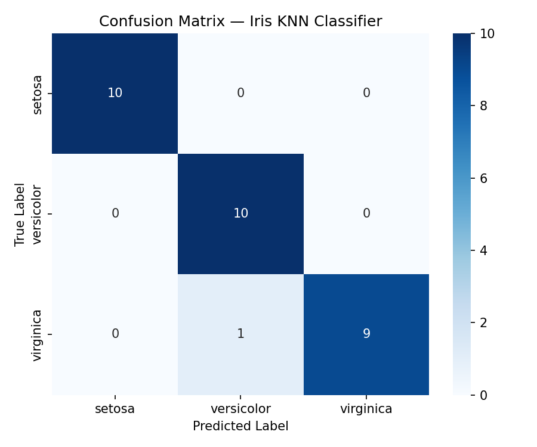
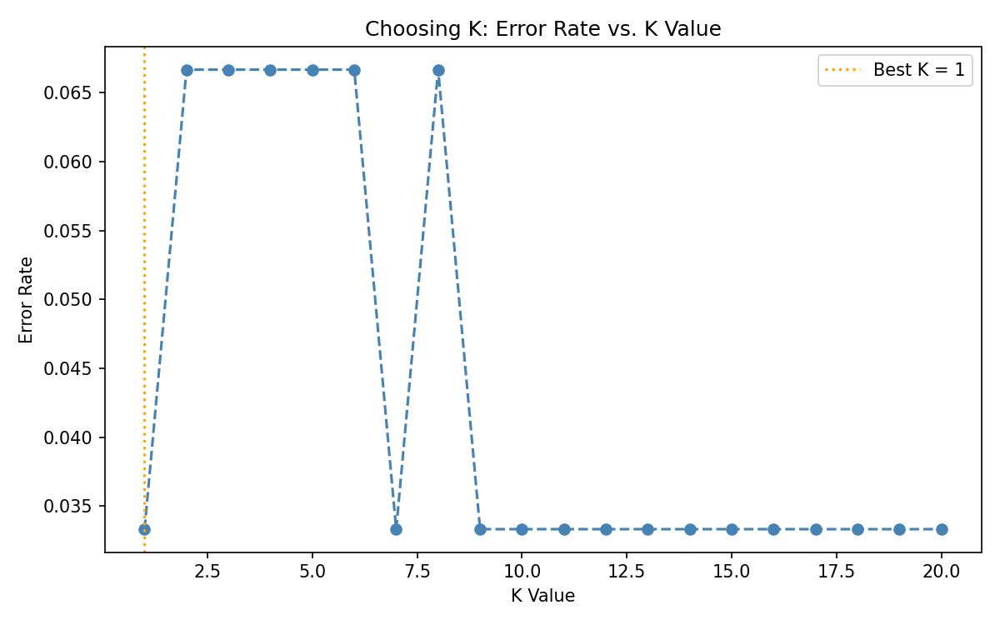

# DecodeLabs Project 2 - Iris Data Classification using KNN

This is my second project in the DecodeLabs AI Industrial Training (Batch 2026).
It classifies iris flowers into 3 species using the K-Nearest Neighbors (KNN)
algorithm and scikit-learn.

## About the Project
The model takes 4 flower measurements (sepal length, sepal width, petal length,
petal width) and predicts whether the flower is Setosa, Versicolor or Virginica.
This is a supervised learning project.

## Dataset
- Iris dataset (built into scikit-learn)
- 150 samples, 4 features, 3 classes

## Steps
1. Load and understand the dataset
2. Split the data into 80% training and 20% testing (shuffled and stratified)
3. Scale the features using StandardScaler (fitted on training data only)
4. Train a KNN model with K = 5
5. Evaluate using accuracy, F1 score, confusion matrix and classification report
6. Try K values from 1 to 20 and compare the error
7. Predict the species of a new flower

## Results
- Accuracy: about 93%
- Weighted F1 score: about 0.93
- Setosa was classified perfectly. Two Virginica samples were predicted as
  Versicolor, since these two classes overlap.

## Technologies Used
- Python
- scikit-learn

## How to Run
```
pip install scikit-learn
python project2_iris_knn.py
```

## What I Learned
- How the supervised learning pipeline works (load, split, scale, train, evaluate)
- Why feature scaling matters for distance-based algorithms like KNN
- Why the scaler should be fitted only on training data (to avoid data leakage)
- How to read a confusion matrix and F1 score instead of relying only on accuracy

-----------------------OUTPUT------------------------
- ### Confusion Matrix


### Choosing K (Elbow Graph)


## Author
Abhishek
Built as part of the DecodeLabs AI Industrial Training, Batch 2026
